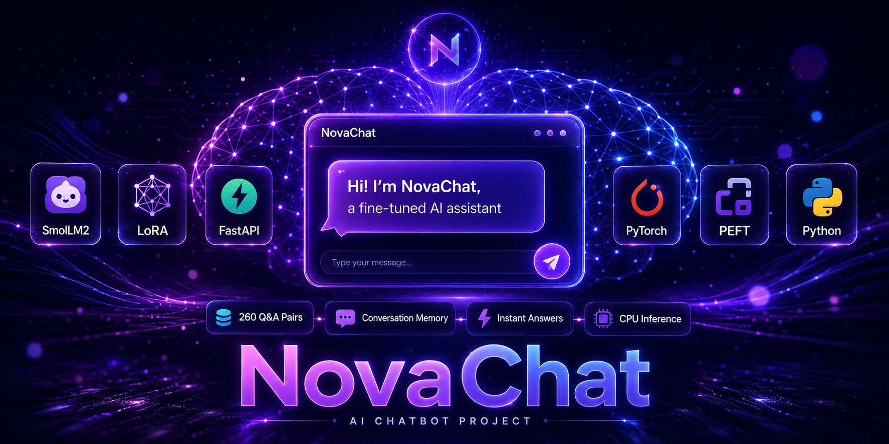
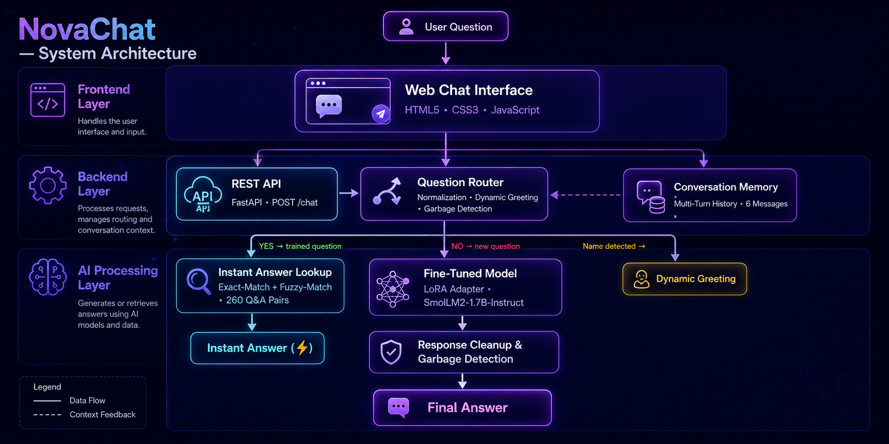
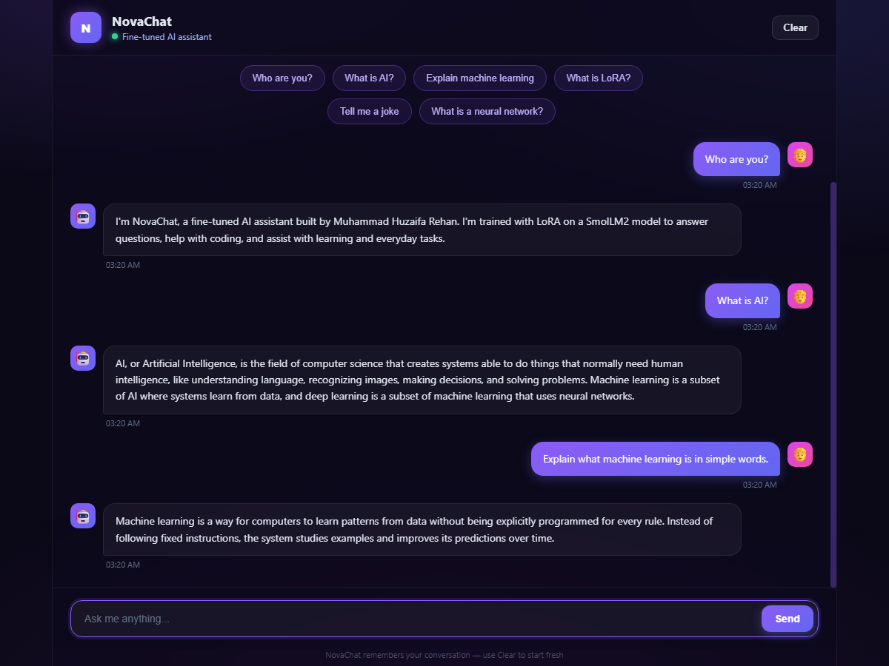

# 🚀 NovaChat — AI-Powered Fine-Tuned LLM Chatbot

<p align="center">
  
</p>


<h3 align="center">
LoRA Fine-Tuned SmolLM2 1.7B Chatbot with FastAPI Backend & Web Chat Interface
</h3>


<p align="center">


</p>


---


A lightweight AI chatbot powered by a LoRA fine-tuned SmolLM2 1.7B model, with a FastAPI backend and a clean web chat interface.


The platform fine-tunes a small, efficient language model on a curated dataset of **260 high-quality Q&A pairs** and serves it through a modern FastAPI service — delivering instant trained answers, fuzzy-matched responses, and model-generated replies that run entirely on CPU.


---


# 📌 Overview


Building a custom chatbot from scratch is challenging. General-purpose models are large and expensive to run, while smaller models need careful fine-tuning to answer questions well.


Typical applications include:


* 💬 FAQ and knowledge assistants
* 🎓 Educational and tutoring bots
* 🏢 Customer-support Q&A systems
* 🧠 Domain-specific assistants
* 🚀 Lightweight on-device chat agents
* 📚 Curriculum-based learning tools


Traditional chatbot development is challenging because of:


* Large model sizes and high computational cost
* Slow inference on consumer hardware
* Generic answers that do not fit a specific domain
* Difficulty controlling response style and tone
* Requirement for cloud infrastructure


This project automates the complete workflow by fine-tuning a small open model with **LoRA**, then serving it with an exact-match, fuzzy-match, and model-inference pipeline that runs locally on CPU.


---


# 🚀 Key Features


| Feature                            | Status |
| ---------------------------------- | :----: |
| LoRA Fine-Tuning                   |    ✅   |
| Custom Instruction Dataset (260 pairs) |  ✅   |
| Instant Exact-Match Answers        |    ✅   |
| Fuzzy-Match for Paraphrased Questions |  ✅   |
| CPU Inference (Runs Locally)       |    ✅   |
| FastAPI REST API                   |    ✅   |
| Web Chat UI                        |    ✅   |
| Google Colab Training Notebook     |    ✅   |
| Garbage-Response Detection         |    ✅   |
| Multi-Turn Conversation Memory     |    ✅   |
| Offline Base Model Support         |    ✅   |


---


# 🏗️ System Architecture


<p align="center">
  
</p>


The platform is organised into three primary layers:


* **Frontend Layer** — A single-page chat interface built with HTML, CSS and vanilla JavaScript.
* **Backend Layer** — FastAPI REST API responsible for question normalization, matching and model inference.
* **AI Processing Layer** — Executes the LoRA fine-tuned SmolLM2 model for answer generation.


---


# 🌐 Frontend Layer


### Technology Stack


* HTML5
* CSS3
* Vanilla JavaScript
* FastAPI Static File Serving


### Responsibilities


* Chat conversation interface
* Message sending and display
* Typing indicator
* Auto-scrolling message history
* Backend integration


---


# ⚙️ Backend Layer


### Technology Stack


* FastAPI
* Pydantic
* Uvicorn
* Hugging Face Transformers
* PEFT (LoRA)


### Responsibilities


* REST API management
* Question normalization and matching
* Model inference execution
* Trained-answer lookup system
* Garbage-response filtering
* Static file serving


---


# 🤖 AI Processing Layer


The complete AI workflow is performed using the fine-tuned model with smart lookup fallbacks.


```text
User Question
          │
          ▼
Question Normalization
          │
          ▼
Exact-Match Lookup ───── Yes ──► Instant Trained Answer
          │
          ▼
          No
          │
          ▼
Fuzzy-Match Lookup ────── Yes ──► Instant Trained Answer
          │
          ▼
          No
          │
          ▼
LoRA Fine-Tuned Model Inference
          │
          ▼
Response Cleanup & Garbage Detection
          │
          ▼
Final Answer
```


For **multi-turn conversations**, the workflow instead prepends the recent message history as context before inference:


```text
User Question
          │
          ▼
Conversation Memory (previous turns)
          │
          ▼
Normalization & Lookup
          │
          ▼
Model Inference with Context
          │
          ▼
Final Answer
```


---


# 🧠 Deep Learning Models


The project performs **AI inference only**.


No general model training from scratch is included. A small base model is adapted with LoRA for the chat domain.


---


# 🧠 SmolLM2-1.7B-Instruct (Base Model)


SmolLM2-1.7B-Instruct is the base language model used for training and inference.


### Purpose


Provide general language understanding and generation capability.


### Details


* Model: `HuggingFaceTB/SmolLM2-1.7B-Instruct`
* Type: Instruction-tuned small language model
* Runs efficiently on **CPU**
* Can be stored locally in `models/base_1.7b/` for offline use


---


# 🎯 LoRA Adapter (Fine-Tuned)


A lightweight adapter trained on NovaChat's custom instruction dataset.


### Purpose


Adapt the base model to answer questions in a helpful, friendly and consistent style.


### Details


* Technique: LoRA (Low-Rank Adaptation)
* Rank: 16 (alpha 32)
* Target modules: `q_proj`, `k_proj`, `v_proj`, `o_proj`
* Training data: 260 Q&A pairs
* Adapter size: ~25 MB
* Training loss: ~0.85 after 3 epochs
* Location: `models/lora/`


---


# 📸 Screenshots


## 💬 Chat Interface


<p align="center">

</p>


---


# ✨ Features


## ⚡ Instant Trained Answers


Questions present in the training dataset are answered immediately without model inference.


* Exact-match lookup
* Fuzzy-match for paraphrases (e.g. "explain machine learning")
* Case- and punctuation-insensitive matching
* Zero-latency responses


---


## 🤖 Model-Generated Answers


Questions outside the dataset are answered by the fine-tuned model.


* Real-time text generation
* Temperature-based sampling
* Repetition penalty control
* Automatic prompt formatting


---


## 🛡️ Garbage-Response Detection


The backend detects low-quality model outputs and replaces them with a clean, honest fallback message.


* Template-echo detection
* Irrelevant-content filtering
* Empty-response handling


---


## 💬 Multi-Turn Conversation Memory


NovaChat remembers the conversation within a session.


* Previous user/assistant messages are included as context
* Follow-up questions (e.g. "tell me more about them") keep their meaning
* History is capped to the most recent turns to stay within the model's context
* A **Clear** button resets the conversation


---


## 🧠 Instruction-Masked Training


Training loss is computed only on the answer portion of each example, so the model learns to generate answers rather than echo the question template.


---


## 📦 Offline Support


The base model can be stored locally in `models/base_1.7b/`, allowing the chatbot to run without downloading anything from the internet.


---


# 📂 Project Structure


```text
NovaChat/
│
├── backend/
│   ├── app.py                  # FastAPI chatbot service
│   └── static/
│       └── index.html          # Chat web UI
│
├── data/
│   ├── training_data.json      # 260 Q&A training pairs
│   └── training_text.txt       # Generated training text
│
├── models/
│   ├── lora/                   # Fine-tuned LoRA adapter
│   └── base_1.7b/              # Local base model (offline support)
│
├── scripts/
│   ├── build_dataset.py        # Build the instruction dataset
│   ├── prepare_data.py         # Validate and preview the dataset
│   └── train_lora.py           # LoRA fine-tuning script
│
├── NovaChat_Train.ipynb        # Google Colab training notebook
├── requirements.txt
├── .gitignore
├── README.md
├── NovaChat.png                # README hero image
├── architecture.png            # System architecture diagram
└── dashboard.png               # Chat interface screenshot
```


---


# 🔌 Backend API Endpoints


| Endpoint | Method | Purpose                          |
| -------- | ------ | -------------------------------- |
| `/`      | GET    | Serve the chat web UI            |
| `/health`| GET    | Health check and model info      |
| `/chat`  | POST   | Get a chat response              |


---


# 💻 Installation


## Clone Repository


```bash
git clone https://github.com/huzaifa-ai-tech/NovaChat.git


cd NovaChat
```


---


## Backend Setup


Create a virtual environment:


```bash
python -m venv venv
```


Activate the environment.


**Windows**


```bash
venv\Scripts\activate
```


**Linux / macOS**


```bash
source venv/bin/activate
```


Install backend dependencies:


```bash
pip install -r requirements.txt
```


Start the backend server:


```bash
python -m uvicorn backend.app:app --reload
```


Backend Server:


```
http://127.0.0.1:8000
```


Open the URL in your browser to start chatting.


---


## 🧠 Model Setup


The chatbot needs the base model and the LoRA adapter:


1. **LoRA adapter** — the fine-tuned adapter is **not bundled** in this repository. Train it yourself with `python scripts/train_lora.py` (or run the Google Colab notebook), then place the adapter files in `models/lora/`.
2. **Base model** — on first run, the backend auto-downloads `SmolLM2-1.7B-Instruct` automatically. For offline use, place the model files in `models/base_1.7b/`.


---


# 📊 Generated Outputs


The system automatically generates multiple outputs after training and inference.


## 💬 Chat Responses


* Instant trained answers
* Fuzzy-matched paraphrased answers
* Model-generated answers


---


## 🎯 Training Artifacts


* LoRA adapter (~25 MB)
* Instruction dataset (260 Q&A pairs)
* Training text file
* Google Colab training notebook


---


# 🛠️ Technologies Used


## 🤖 Artificial Intelligence


* PyTorch
* Hugging Face Transformers
* PEFT (LoRA)
* SmolLM2-1.7B-Instruct
* SmolLM2-360M-Instruct


---


## ⚙️ Backend


* FastAPI
* Pydantic
* Uvicorn
* Python


---


## 🌐 Frontend


* HTML5
* CSS3
* Vanilla JavaScript


---


# ⚡ Advantages


* Lightweight and runs on **CPU**
* **Instant answers** for trained questions
* Fuzzy matching understands paraphrases
* Clean, dark-themed chat interface
* Complete fine-tuning pipeline included
* Instruction-masked training for better quality
* Garbage-response detection for reliable replies
* Optional offline mode with a local base model
* Easy to retrain with more data


---


# ⚠️ Limitations


* Model-generated answers take a few seconds on CPU
* Small model size limits deep reasoning compared to large commercial LLMs
* Answers outside the training data depend on base model knowledge
* No authentication or user accounts


---


# 🔮 Future Improvements


Planned enhancements include:


* Larger, expanded training dataset
* Web-based dataset editor
* Quantized inference for faster CPU responses
* Docker deployment
* Voice input and output
* Response confidence scoring
* Integration with additional base models
* Cloud deployment


---


# 👨‍💻 Author


**Huzaifa**


GitHub:
https://github.com/huzaifa-ai-tech


---


# 🙏 Acknowledgements


This project is built using several outstanding open-source technologies:


* [SmolLM2](https://huggingface.co/HuggingFaceTB/SmolLM2-1.7B-Instruct)
* [PyTorch](https://pytorch.org/)
* [Hugging Face Transformers](https://huggingface.co/)
* [PEFT](https://github.com/huggingface/peft)
* [FastAPI](https://fastapi.tiangolo.com/)


Special thanks to the open-source community for providing these powerful tools and frameworks that made this project possible.


---


# ⚠️ Disclaimer


This project is developed for educational purposes.


Chatbot responses are generated by an AI model and may occasionally be inaccurate or incomplete. Responses should be interpreted as AI-assisted output rather than definitive ground truth.


---


# ⭐ Support


If you found this project useful, please consider giving it a **⭐ Star** on GitHub.


Your support helps improve the project and motivates future development.
